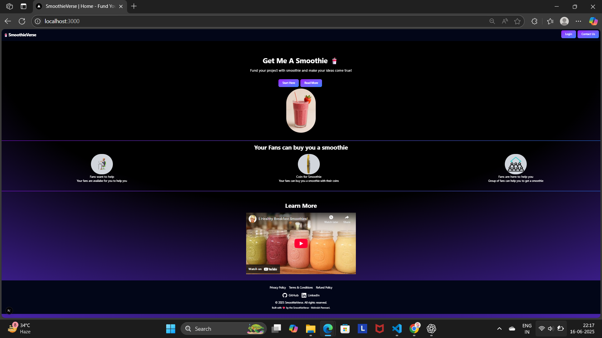
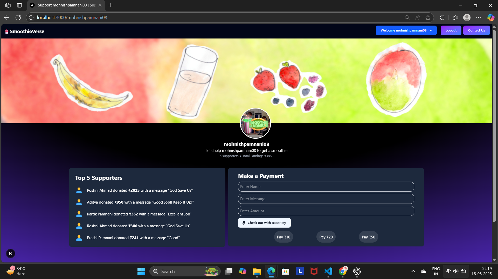

# 🥤 SmoothieVerse Crowdfunding Platform

Welcome to **SmoothieVerse** – a modern, visually stunning crowdfunding platform where creators and supporters connect over the love of smoothies! Launch your campaign, receive support, and make your dreams come true.

---

## 🚀 Project Description
SmoothieVerse is a full-stack web application that enables users to create profiles, launch fundraising campaigns, and receive payments securely via Razorpay. Supporters can easily contribute and leave messages, while creators manage their campaigns through a beautiful dashboard.

---

## 🛠️ Tech Stack
- **Frontend:** Next.js 14, React, Tailwind CSS
- **Backend:** Next.js API Routes, Node.js
- **Database:** MongoDB (Mongoose ODM)
- **Authentication:** NextAuth.js (Google, GitHub OAuth)
- **Payments:** Razorpay
- **Other:** React Toastify, modern SVG/animated assets

---

## ✨ Features
- User authentication (Google, GitHub)
- User profile and dashboard
- Launch and manage crowdfunding campaigns
- Secure payments via Razorpay
- Public supporter wall with messages
- Responsive, modern UI with dark theme
- Legal pages: Privacy Policy, Terms, Refund Policy
- Contact form

---

## 📸 Screenshots


| Home Page | Payment Page 
|-----------|-----------
|  |  |

---

## ⚙️ Environment Variables
Create a `.env.local` file in the root directory and add the following:
```
MONGODB_URI=mongodb_connection_string GOOGLE_ID=oogle_client_id GOOGLE_SECRET=client_secret GITHUB_ID=github_client_id GITHUB_SECRET=github_client_secret NEXTAUTH_URL=http://localhost:3000 NEXT_PUBLIC_KEY_ID=your_razorpay_key_id KEY_SECRET=your_razorpay_key_secret NEXT_PUBLIC_URL=http://localhost:3000
```


---

## 🛠️ Installation
1. **Clone the repository:**
   ```bash
   git clone https://github.com/Mohnish27-dev/smoothieverse.git
   cd smoothieverse

2. **Install dependencies**
   ```
   npm install
   or
   yarn install
   ```
3. Add environment variables:
Copy .env.example to .env.local and fill in your credentials.
4. Run MongoDB:
Make sure MongoDB is running locally or use a cloud provider (e.g. MongoDB Atlas).

## ▶️ Running Locally
```
   npm run dev
   or
   yarn dev
   ```
Visit http://localhost:3000 in your browser.

## 💡 Usage / Examples
- Sign up with Google or GitHub
- Create your profile and set up your campaign
- Share your campaign link with supporters
- Receive payments and see messages on your dashboard
- Manage your profile and view supporter history

--- 
## 🤝 Contributing
Pull requests are welcome! For major changes, please open an issue first to discuss what you would like to change.

---

## 🌐 Connect
- <a href="https://github.com/Mohnish27-dev">GitHub</a>
- <a href="https://www.linkedin.com/in/mohnish-pamnani-595a81284/">LinkedIn</a>
- <a href="mailto:mohnishpamnani08@gmail.com">Email</a>
